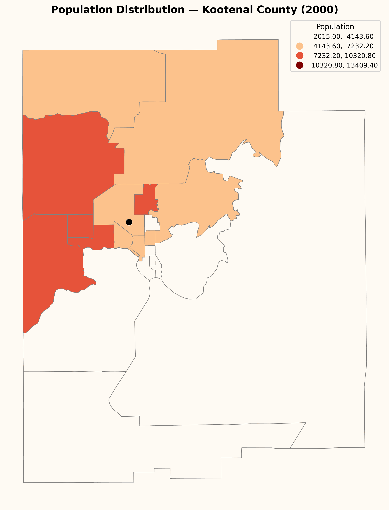
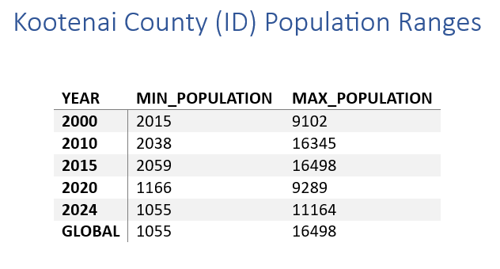
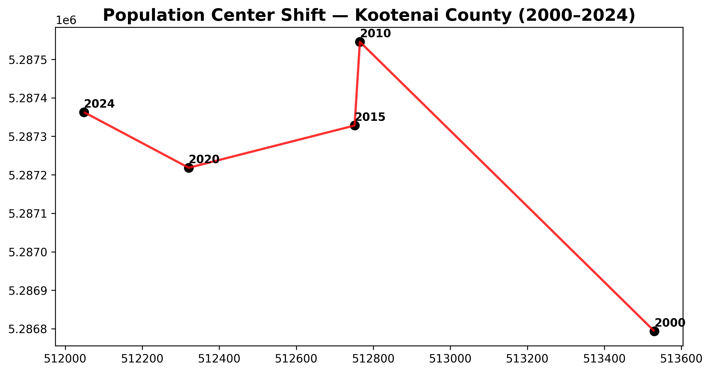

# Kootenai County Population Shift Analysis (2000–2024)

## Project Overview

This project analyzes the spatial shift of population distribution in Kootenai County, Idaho from 2000 to 2024 using U.S. Census tract-level population data and Cartographic boundary files.

The project combines:
- Census API population data
- Cartographic boundary files
- Spatial joins and choropleth mapping
- Population-weighted center calculations
- Temporal movement analysis

---

## Objectives

- Visualize tract-level population distribution patterns
- Calculate population-weighted centers
- Measure spatial movement of population centers
- Build a reproducible GIS workflow in Python

---

## Tools and Libraries

- Python
- GeoPandas
- Pandas
- Matplotlib
- Shapely
- requests
- pathlib
- zipfile

---

## Workflow

1. Download census tract shapefiles (cartographic boundary files)
2. Collect tract population data using Census API
3. Standardize GEOID fields
4. Join population data to tract geometries
5. Reproject to projected CRS (EPSG:26911)
6. Map population distribution across census tracts 
7. Calculate population-weighted centers
8. Visualize spatial movement of population centers over time
9. Animated temporal maps of population shift

---

## Outputs

### Animation of Population Centers with Choropleth Maps 
This animation visualizes tract-level population distribution changes across Kootenai County from 2000 to 2024. Choropleth maps use a standardized classification scheme and global population range to ensure comparability across years. The black point represents the yearly population-weighted center.

---
### Population Ranges
To maintain temporal consistency across choropleth maps:

- Population ranges were calculated for each study year
- A global minimum and maximum population range was derived across all years
- Equal-interval classification bins were applied consistently to all maps

---

### Population Center Shift
This figure shows the spatial movement of the population-weighted center across study years. Results indicate a gradual shift in population distribution over time. From 2000 to 2010, the population center moved northwest by approximately 1 km. From 2010 to 2024, the population center gradually shifted south and west, with a total movement of roughly 1 km over the period. Distances between consecutive population centers were also exported as tabular outputs for additional spatial analysis.

---

## Technical Components

- Census API integration
- GIS spatial analysis
- GeoPandas workflows
- Coordinate system handling
- Spatial-temporal visualization
- Data cleaning and standardization

---

